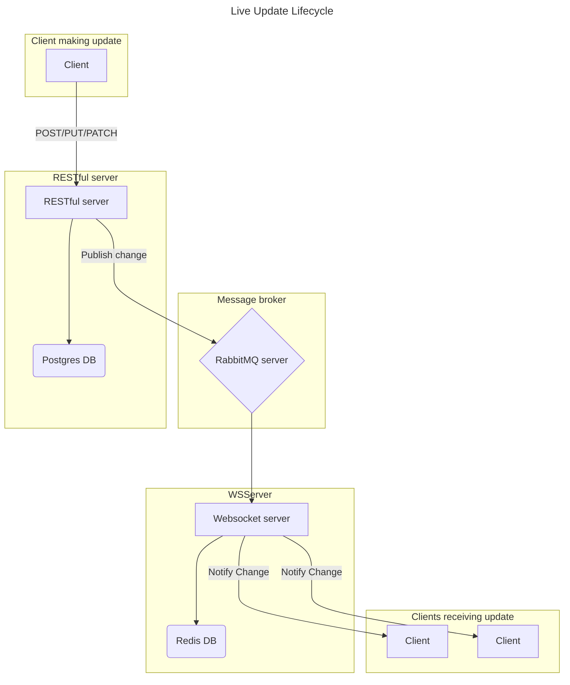

# workflow manager

[Website link]()

## Objective

Showcase some of my current developer skills and knowledge.
- Standard practices
    - RESTful API
    - Event system
    - Live updates
    - Mobile friendly interface
- Technologies
    - Application layer protocols
        - http
        - ws
        - postgresql
        - amqp
        - redis
    - tooling
        - Bazel
        - git
    - java 
        - Spring framework
            - jpa
            - rabbitmq
            - redis
            - websocket
        - CEL compiler
    - javascript/typescript
        - react
        - mobx
        - tailwind
        - shadcn
        - websocket

## How it works?

### Live update
This is a simple application to define workflows as state machines. All mutations to an entities' state or its data is done using a RESTful API. Any mutation will trigger an event and other users will be notified of the update.

The live update system works like this:
1. RESTful request mutates data and publishes message to rabbitmq exchange
2. Websocket server receives the message and
    - Stores the message in a short lived redis buffer
    - Notifies any ws client subscribed to the event

The redis buffer is used to rapidly sync a subscription and resolve race conditions.

The web client has a store that only updates data if the incoming data has its update time greater than current update time.

### CEL interpreter
The server has an instance of a CEL runtime from cel-java that binds the user defined attributes to an expression. The expression is evaluated and its result is used to validate if a mutation is allowed.

### Shared sessions
Sessions are shared by simply using a UUID to identify the session. While not a very secure way to store data, it is a very simple way of demonstrating a tool's capabilities on a shared environment without exposing a viewer to trolls and allowing for seamless session sharing.
